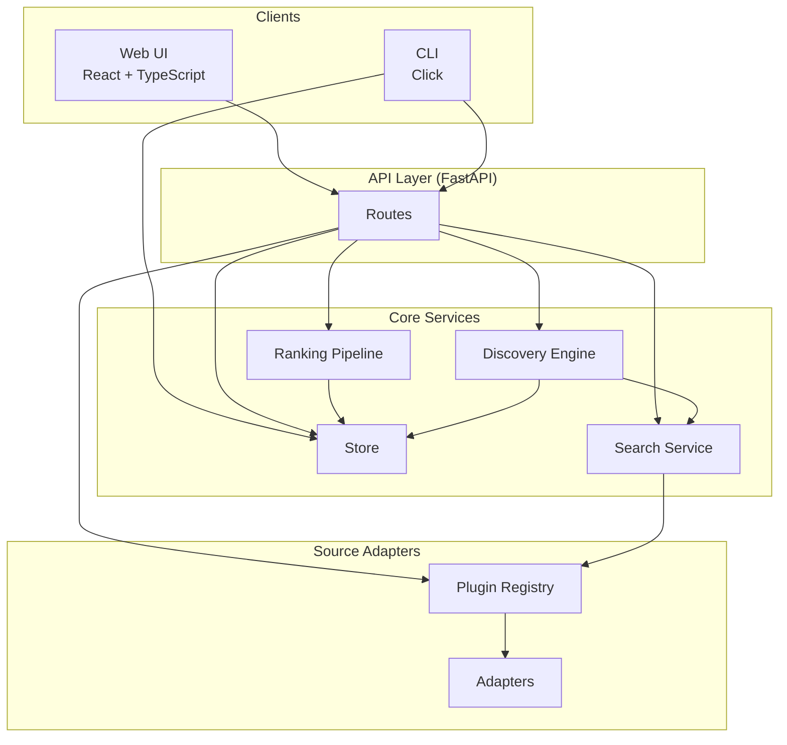
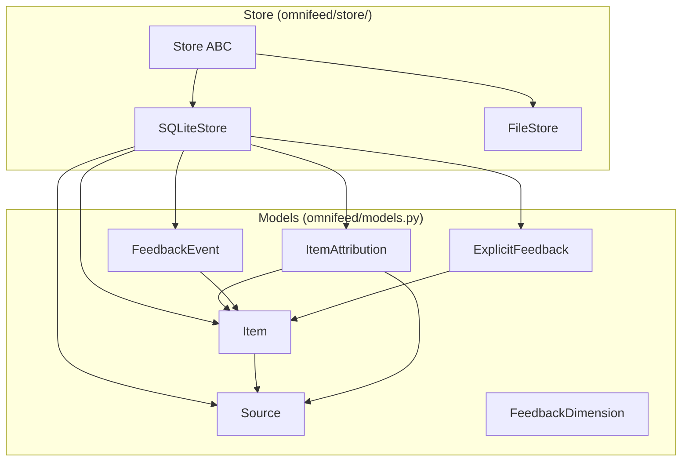
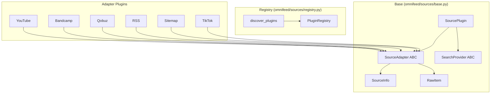
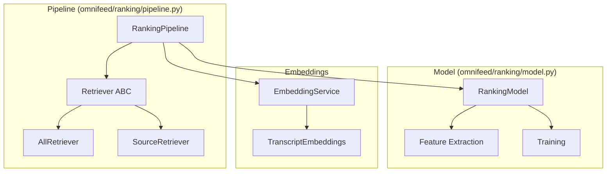
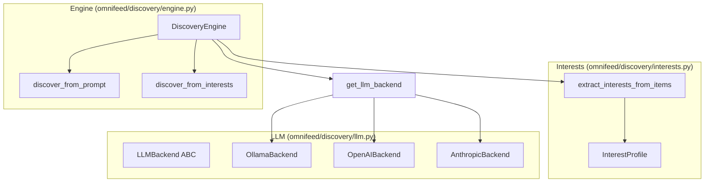
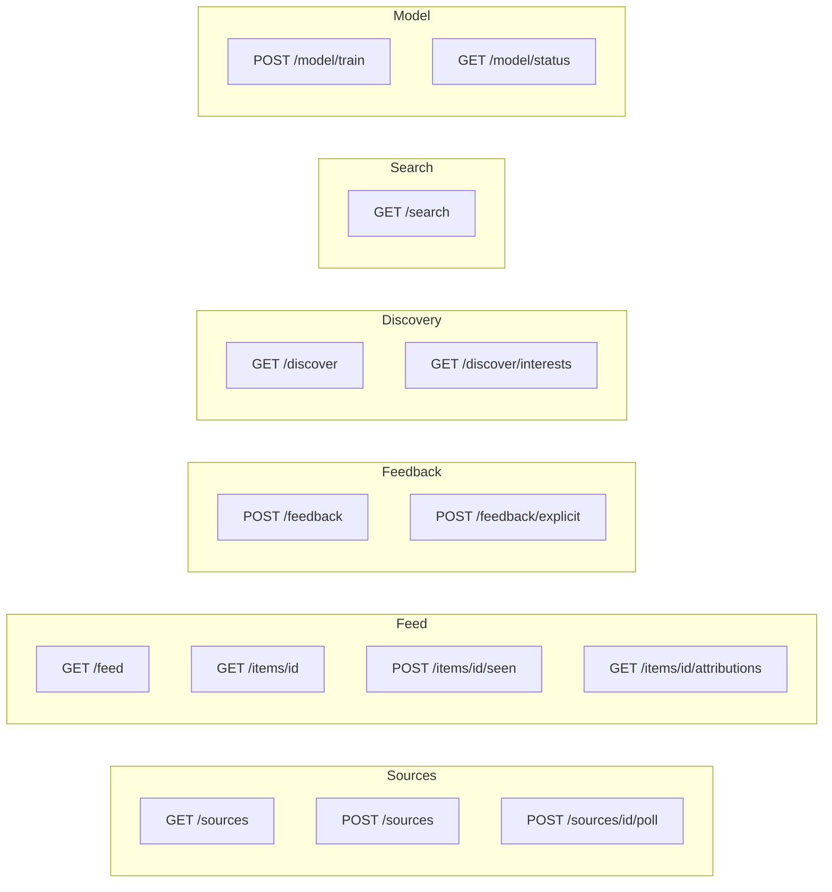

# OmniFeed Architecture

## High-Level Overview



## Data Layer



## Source Adapter System



## Ranking System



## Discovery System



## API Routes



## Directory Structure

```
omnifeed/
├── models.py           # Core data models
├── config.py           # Configuration
├── cli.py              # CLI commands
├── store/
│   ├── base.py         # Store ABC
│   ├── sqlite.py       # SQLite implementation
│   └── file.py         # JSON file implementation
├── sources/
│   ├── base.py         # Adapter/SearchProvider ABCs
│   ├── registry.py     # Plugin discovery
│   ├── youtube/        # YouTube adapter + search
│   ├── bandcamp/       # Bandcamp adapter + search
│   ├── qobuz/          # Qobuz adapter + search
│   ├── rss/            # RSS adapter + Feedly search
│   ├── sitemap/        # Sitemap adapter
│   └── tiktok/         # TikTok adapter
├── adapters/
│   └── __init__.py     # Compatibility shim → sources/
├── ranking/
│   ├── pipeline.py     # Retrieval + scoring
│   ├── model.py        # ML model
│   └── embeddings.py   # Text embeddings
├── discovery/
│   ├── llm.py          # Multi-backend LLM
│   ├── interests.py    # Interest extraction
│   └── engine.py       # Discovery engine
└── search/
    ├── service.py      # Unified search service
    └── *.py            # Provider implementations

api/
└── main.py             # FastAPI routes

web/
└── src/                # React frontend
```
