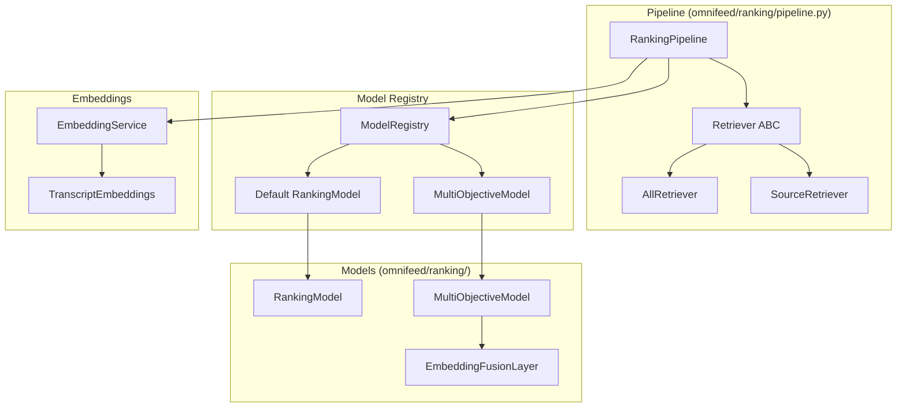
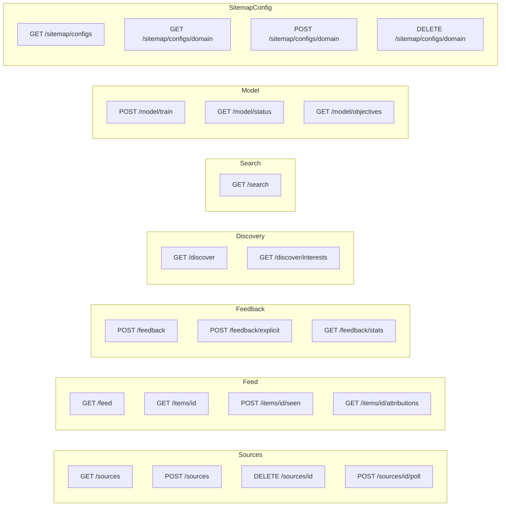

# OmniFeed Architecture

## High-Level Overview


## Data Layer


## Source Adapter System


## Ranking System



### Multi-Objective Ranking

The multi-objective model trains separate reward heads for different content objectives:
- **Entertainment** - Pure enjoyment
- **Curiosity** - Intellectual satisfaction
- **Foundational** - Core knowledge/skills
- **Targeted** - Specific expertise

Users can filter the feed by objective to surface content matching their current goal.

## Discovery System


## API Routes



## Directory Structure

```
omnifeed/
├── models.py           # Core data models
├── config.py           # Configuration
├── cli.py              # CLI commands
├── store/
│   ├── base.py         # Store ABC
│   ├── sqlite.py       # SQLite implementation
│   └── file.py         # JSON file implementation
├── sources/
│   ├── base.py         # Adapter/SearchProvider ABCs
│   ├── registry.py     # Plugin discovery
│   ├── youtube/        # YouTube adapter + search
│   ├── bandcamp/       # Bandcamp adapter + search
│   ├── qobuz/          # Qobuz adapter + search
│   ├── rss/            # RSS adapter + Feedly search
│   ├── sitemap/        # Sitemap adapter (config-driven extraction)
│   └── tiktok/         # TikTok adapter
├── adapters/
│   └── __init__.py     # Compatibility shim → sources/
├── ranking/
│   ├── pipeline.py     # Retrieval + scoring
│   ├── model.py        # Default ML model
│   ├── multi_objective.py  # Multi-objective model
│   ├── registry.py     # Model registry
│   └── embeddings.py   # Text embeddings
├── discovery/
│   ├── llm.py          # Multi-backend LLM
│   ├── interests.py    # Interest extraction
│   └── engine.py       # Discovery engine
└── search/
    ├── service.py      # Unified search service
    └── *.py            # Provider implementations

api/
└── main.py             # FastAPI routes

web/
└── src/
    ├── components/
    │   ├── FeedItem.tsx      # Feed item display
    │   ├── FeedList.tsx      # Paginated feed
    │   ├── ReaderPane.tsx    # Content reader with feedback
    │   ├── Sidebar.tsx       # Source navigation
    │   ├── StatsView.tsx     # Engagement stats + model training
    │   ├── SourcesView.tsx   # Source management
    │   └── renderers/        # Content type renderers
    │       ├── HtmlRenderer.tsx
    │       ├── TextRenderer.tsx
    │       ├── YouTubeRenderer.tsx
    │       ├── QobuzRenderer.tsx
    │       ├── TikTokRenderer.tsx
    │       └── WebPageRenderer.tsx  # iframe fallback
    └── api/
        ├── client.ts         # API client functions
        └── types.ts          # TypeScript types

~/.omnifeed/
├── config.json           # User configuration
├── omnifeed.db           # SQLite database
├── ranking_model.pkl     # Default model
├── multi_objective_model.pkl  # Multi-objective model
└── sitemap_configs/      # Per-domain sitemap extraction configs
    └── <domain>.json
```
